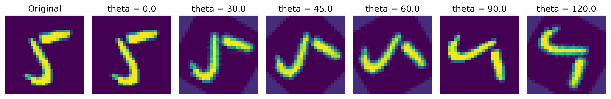
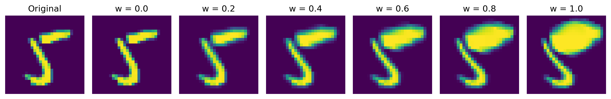
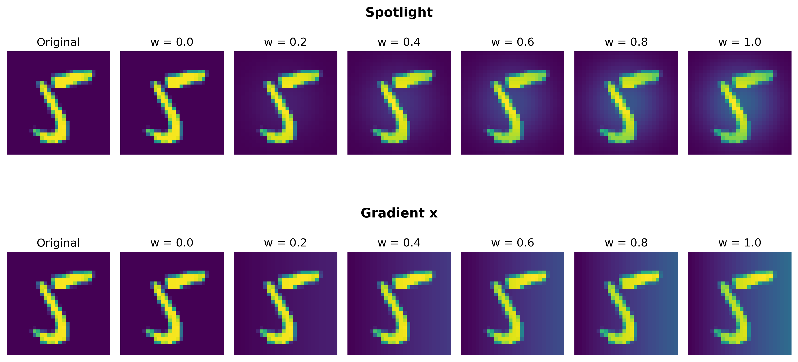

# Verifying Structural Robustness of Deep Neural Network

> Neural network verification has emerged as a useful technique for improving the reliability of deep learning systems. Current verification approaches primarily focus on local robustness, where perturbations are applied independently to each input element. Despite its common use, local robustness does not capture perturbations that exhibit coordinated relationships between input elements. Such perturbations arise from systematic transformations or filtering operations that preserve structural characteristics of the data. These perturbations, which we call "structural robustness", represent a significant gap in existing verification capabilities.
> 
> This work focuses on structural robustness verification by formalizing two important classes of structured perturbations: linear position-invariant and linear position-varying. Those perturbations allow input elements to be modified in coordinated ways while preserving essential data structure. The main challenge is that structural perturbations cannot be directly expressed using standard interval-based specification formats that existing verification tools typically support.
> 
> To address this limitation, we introduce VeriS, a technique that reformulates structural robustness into standard local robustness problems by creating specialized subnetworks that encode perturbation behavior and integrates them with the original network architecture. VeriS enables verification across continuous spaces defined by structural robustness specifications while maintaining compatibility with existing verification tools. VeriS also introduces optimizations that significantly enhance verification performance such as converting complex operations into standard representations.
> 
> We implement and evaluate VeriS on benchmarks involving neural networks across three domains: image classification, audio processing, and healthcare applications. Our evaluation, which encompasses 5508 verification problems, demonstrates that VeriS successfully verifies 78% of structural robustness specifications when integrated with state-of-the-art verification tools. These results show that VeriS enables the verification of complex structural perturbations that were previously beyond the reach of existing neural network verification.

- Rotatation

<p align="center">
  
</p>

- Deformation

<p align="center">
  
</p>

- Lightness

<p align="center">
  
</p>

## Getting Started

### 1. Install required packages

```bash
pip install -r requirements.txt
```

### 2. Datasets

- Download [CardiacArrhythmia dataset](https://physionet.org/files/challenge-2017/1.0.0/training2017.zip) and unzip it into `data/CardiacArrhythmia/` folder.
    ```bash
    wget -L -O data/CardiacArrhythmia/training2017.zip https://physionet.org/files/challenge-2017/1.0.0/training2017.zip
    ```
- Google Speech Commands and MNIST datasets will be downloaded automatically.


### 3. Train models

- This script will train 4 models: `KWS_M5`, `KWS_M3`, `ECG_M5`, `ECG_M3`, each with 2 different configurations (`n_channel=32` and `n_channel=64`)

    ```bash
    make train
    ```

- Default location of checkpoints is `checkpoints/`


### 4. Generate verification problems

- This script will generate specifications for all models `KWS_M5`, `KWS_M3`, `ECG_M5`, `ECG_M3`
    ```bash
    make spec
    ```

- Generated specifications are stored at `GEN_SPEC_DIR` speficied in [Makefile](Makefile). Networks are stored at `onnx`, specifications are stored at `vnnlib`, and `instances.csv` defines verification problems, where each problem is a tuple of (network, specification).
    ```
    generated_benchmark_new/
    ├── time_invariant
    │   └── kws_m3_32
    │       ├── command.sh
    │       ├── instances.csv
    │       ├── onnx
    │       └── vnnlib
    └── time_varying
        └── kws_m3_32
            ├── command.sh
            ├── instances.csv
            ├── onnx
            └── vnnlib
    ```

### 5. Verify problems

#### 5.1. Download verifiers

- Download [alpha-beta-CROWN](https://github.com/Verified-Intelligence/alpha-beta-CROWN) and store at `../exp/abcrown/` (default location in [Makefile](Makefile))
- Download [NeuralSAT](https://github.com/dynaroars/neuralsat) and store at `../exp/neuralsat/` (default location in [Makefile](Makefile))

#### 5.2. Verify problems

- This script will run `alpha-beta-CROWN` and `NeuralSAT` to verify all generated instances

    ```bash
    make verify
    ```

- The experiments might take up to `3 * 5000 * 30 / 3600 = 125` hours (1 variant of `NeuralSAT` and 2 variants of `alpha-beta-CROWN`, 5000+ problems, 30 seconds timeout per problem).

### 6. Reproduce figures and tables


- Extract all results and save to CSV files:
    ```bash
    make create_csv
    ```

- Create figures:
    ```bash
    make create_plot
    ```

- Create tables:
    ```bash
    make create_table
    ```

# Citation

```
@article{duong2026verifying,
  title={{Verifying Structural Robustness of Deep Neural Network}},
  author = {Duong, Hai and Le, Thanh and Nguyen, Lam and Nguyen, ThanhVu},
  journal={Proceedings of the ACM on Software Engineering},
  volume={3},
  number={FSE},
  year={2026},
  pages={to appear}
}
```